# Project Overview

This project aims to develop and train multiple image classification models using pretrained convolutional neural network (CNN) architectures as backbones on a custom dataset of gel electrophoresis images. The goal is to explore the performance of these models with different configurations, including various classifier heads and optimization algorithms. The project utilizes transfer learning techniques via feature extraction and is implemented using the PyTorch deep learning framework within the Google Colab environment.

Gel electrophoresis is a widely used technique in molecular biology for separating DNA, RNA, or proteins based on their size and charge. Accurate classification of gel images is crucial for various biological research applications. This project focuses on developing effective models to automate the classification process.


## Goal

The goal of this project is to investigate and compare the performance of different models in classifying grayscale gel images. By training and evaluating 24 models with varying configurations, I aim to identify the most effective model architecture and configuration for accurate gel electrophoresis image classification.


## Dataset 

The [dataset](dataset/) consists of 92 grayscale gel electrophoresis images gathered from the internet and organized into two subfolders based on their class, 'gel' and 'not_gel'. Each class contains 46 images, resulting in a balanced dataset.


## Models and Configurations

The models were evaluated based on four factors that influenced the training:

**1- Model Architecture:**

As a backbone, I chose 3 pretrained CNN architectures to be implemented in this project:

* ResNet18

* VGG16 

* MobileNetV3


**2- Classifier Head:**

I used the mentioned backbones as a feature extractor and customized them by replacing the final fully connected layer with either:

* Single linear layer as the classifier head (single layer for shortcut): This configuration consists of a single linear layer for classification.

* Sequential multi-layer as the classifier head (multi-layer for shortcut): This configuration comprises multiple linear layers for classification, providing a deeper and more complex structure.


**3- Optimizer Algorithm:**

I trained each architecture/head combination using either the Adam or SGD optimizer. Both optimizers utilized the CrossEntropyLoss function and were set with a fixed learning rate of 0.001 to ensure a fair comparison.

* Adam: is an adaptive learning rate optimization algorithm that is widely used for its simplicity and robustness. It adjusts the learning rate dynamically during training to improve convergence.

* SGD (Stochastic Gradient Descent): is a traditional optimization algorithm that updates the model parameters with the gradients of the loss function. It iteratively adjusts the weights with a fixed learning rate to minimize the loss.

**4- Hardware platform:**

I trained the models on two types of hardware platforms:

* CPU (Central processing unit): designed for sequential serial processing.

* GPU (Graphics processing unit): designed for parallel processing which makes it useful for accelerating machine learning and deep learning tasks.


## Configurations Breakdown

| Configuration | Number of Models |
|---|---|
| **Hardware Type** | |
| CPU | 12 |
| GPU | 12 |
| **Pretrained Model** | |
| ResNet18 | 8 |
| VGG16 | 8 |
| MobileNet-V3 | 8 |
| **Classifier Head** | |
| Single Linear Layer | 12 |
| Multi-Layer | 12 |
| **Optimization Algorithm** | |
| Adam | 12 |
| SGD | 12 |


# Project Pipeline and Workflow

The project consists of 4 core Python script files that collaborate in the model development process in a structured and modular manner:

* `utils.py`: contains reusable utility functions used throughout the project.

* `build_dataset.py`: implements code to load the dataset, preprocess the images, and split the data into training and validation sets.

* `prepare_model.py`: implements functions to initialize pretrained CNN architectures (ResNet18, VGG16, MobileNetV3) from PyTorch, modifying them for grayscale input and customized classification heads.

* `train.py`: implements the main training loop logic, handling command-line parameter parsing, model selection, data loading, training, validation, metric tracking, model saving, and result logging.


# Implementation  

Each of the following 6 notebooks focuses on training and evaluating a specific base model architecture (ResNet18, VGG16, or MobileNetV3) on either a CPU or GPU, as well as evaluating the model's performance and making inferences.

* [1_Gel_Classifier_ResNet18.ipynb](1_Gel_Classifier_ResNet18.ipynb): This Jupyter notebook showcases the implementation of training a customized ResNet18 model on CPU. 

* [2_Gel_Classifier_VGG16.ipynb](2_Gel_Classifier_VGG16.ipynb): This Jupyter notebook showcases the implementation of training a customized VGG16 model on CPU. 

* [3_Gel_Classifier_MobileNetV3.ipynb](3_Gel_Classifier_MobileNetV3.ipynb): This Jupyter notebook showcases the implementation of training a customized MobileNetV3 model on CPU.

* [4_Gel_Classifier_ResNet18.ipynb](4_Gel_Classifier_ResNet18.ipynb): This Jupyter notebook showcases the implementation of training a customized ResNet18 model on GPU. 

* [5_Gel_Classifier_VGG16.ipynb](5_Gel_Classifier_VGG16.ipynb): This Jupyter notebook showcases the implementation of training a customized VGG16 model on GPU. 

* [6_Gel_Classifier_MobileNetV3.ipynb](6_Gel_Classifier_MobileNetV3.ipynb): This Jupyter notebook showcases the implementation of training a customized MobileNetV3 model on GPU. 


# Model Training Process

To train the 24 models, I executed the `train.py` script 24 times, utilizing the 6 Jupyter notebooks mentioned above. I organized 4 executions within each notebook, and each run involved specifying unique model configurations through command-line arguments and providing specific file paths.

## Example:

```
python train.py 
  --dataset_dir='/dataset'
  --model_id=1
  --hardware_type='cpu'  
  --pretrained_model='resnet18'
  --classifier_head='single'
  --opt_alg='adam'
  --model_path='/gel_classifier-1.pth'
  --plots_path='/gel_classifier-1.png'
  --results_file='/results.csv'
```

## Command arguments:

| Name | Description | Default |
|-|-|-|
|--dataset_dir| Path to the Dataset Directory | './data'|
|--model_id| The ID number assigned to the model| 1|  
|--hardware_type| The type of the hardware used to train the model (cpu, gpu) |'cpu'|
|--pretrained_model| Pretrained model (resnet18, vgg16, mobilenet-v3)|'resnet18'|
|--classifier_head| The architecture of the classifier head to use (single, multi)|'single'|
|--opt_alg| Type of the optimizer algorithm to use (adam, sgd)|'adam'|
|--learning_rate| Learning rate for the optimizer|0.001|
|--batch_size| Batch size|23|
|--num_epochs| Number of training epochs|20|
|--model_path| Path to save the custom trained model parameters/weights|'./models/model.pth'|
|--plots_path| Path to save the loss and accuracy plots|'./plots/'|
|--results_file| Path to save the comparison results|'results.csv'|


# Model Evaluation Results

The table below summarizes the performance of the 24 models trained with different architectures and hyperparameters, each row in the table corresponds to a specific model configuration. The results were recorded in the [results.csv](results.csv) file generated at the end of training for each model. 


| model_id | hardware_type | pretrained_model | classifier_head | opt_alg | training_time_mins | inference_time_secs | accuracy | precision | recall | conf_mat | roc_auc |
|-|-|-|-|-|-|-|-|-|-|-|-|
| 1 | cpu | resnet18 | single | adam | 5.87778879404068 | 8.196835994720459 | 81.82% | 86.67% | 81.82% | [[7, 4], [0, 11]] | 81.82% |
| 2 | cpu | resnet18 | single | sgd | 5.875684936841329 | 9.499671697616575 | 68.18% | 80.56% | 68.18% | [[4, 7], [0, 11]] | 68.18% |
| 3 | cpu | resnet18 | multi | adam | 5.881606896718343 | 9.242843866348268 | 81.82% | 86.67% | 81.82% | [[7, 4], [0, 11]] | 81.82% | 
| 4 | cpu | resnet18 | multi | sgd | 3.714953029155731 | 4.776238441467285 | 90.91% | 92.31% | 90.91% | [[9, 2], [0, 11]] | 90.91% |
| 5 | cpu | vgg16 | single | adam | 38.97634260257085 | 21.181527137756348 | 68.18% | 80.56% | 68.18% | [[4, 7], [0, 11]] | 68.18% |
| 6 | cpu | vgg16 | single | sgd | 39.28553481896719 | 22.356066465377808 | 50.00% | 25.00% | 50.00% | [[0, 11], [0, 11]] | 50.00% | 
| 7 | cpu | vgg16 | multi | adam | 40.49127728939057 | 21.004456520080566 | 77.27% | 84.38% | 77.27% | [[6, 5], [0, 11]] | 77.27% |
| 8 | cpu | vgg16 | multi | sgd | 40.26367266575495 | 22.94587540626526 | 77.27% | 84.38% | 77.27% | [[6, 5], [0, 11]] | 77.27% |
| 9 | cpu | mobilenet-v3 | single | adam | 3.222896846135457 | 6.839791774749756 | 54.55% | 76.19% | 54.55% | [[11, 0], [10, 1]] | 54.55% |
| 10 | cpu | mobilenet-v3 | single | sgd | 3.4531890551249185 | 13.87570333480835 | 54.55% | 56.47% | 54.55% | [[9, 2], [8, 3]] | 54.55% |  
| 11 | cpu | mobilenet-v3 | multi | adam | 3.35837957461675 | 6.238333702087402 | 63.64% | 69.41% | 63.64% | [[10, 1], [7, 4]] | 63.64% |
| 12 | cpu | mobilenet-v3 | multi | sgd | 3.4187332073847454 | 15.212673664093018 | 68.18% | 69.64% | 68.18% | [[9, 2], [5, 6]] | 68.18% |
| 13 | gpu | resnet18 | single | adam | 0.3079824447631836 | 4.64704704284668 | 81.82% | 86.67% | 81.82% | [[7, 4], [0, 11]] | 81.82% |
| 14 | gpu | resnet18 | single | sgd | 0.3234382589658101 | 6.50952672958374 | 90.91% | 92.31% | 90.91% | [[9, 2], [0, 11]] | 90.91% |
| 15 | gpu | resnet18 | multi | adam | 0.3120910326639811 | 5.272719383239746 | 86.36% | 89.29% | 86.36% | [[8, 3], [0, 11]] | 86.36% |  
| 16 | gpu | resnet18 | multi | sgd | 0.3181058406829834 | 6.478391647338867 | 95.45% | 95.83% | 95.45% | [[11, 0], [1, 10]] | 95.45% |
| 17 | gpu | vgg16 | single | adam | 0.9037617484728496 | 4.949237108230591 | 72.73% | 82.35% | 72.73% | [[5, 6], [0, 11]] | 72.73% |
| 18 | gpu | vgg16 | single | sgd | 0.5543939312299092 | 5.194904088973999 | 77.27% | 79.46% | 77.27% | [[7, 4], [1, 10]] | 77.27% | 
| 19 | gpu | vgg16 | multi | adam | 0.5677111983299256 | 5.921305418014526 | 77.27% | 84.38% | 77.27% | [[6, 5], [0, 11]] | 77.27% |
| 20 | gpu | vgg16 | multi | sgd | 0.5407225330670674 | 6.444743633270264 | 77.27% | 79.46% | 77.27% | [[7, 4], [1, 10]] | 77.27% |
| 21 | gpu | mobilenet-v3 | single | adam | 1.3680107553799947 | 4.879338026046753 | 68.18% | 69.64% | 68.18% | [[9, 2], [5, 6]] | 68.18% | 
| 22 | gpu | mobilenet-v3 | single | sgd | 0.3197624882062276 | 5.102678060531616 | 77.27% | 79.46% | 77.27% | [[7, 4], [1, 10]] | 77.27% |
| 23 | gpu | mobilenet-v3 | multi | adam | 0.3326810797055562 | 5.30916953086853 | 63.64% | 78.95% | 63.64% | [[11, 0], [8, 3]] | 63.64% |
| 24 | gpu | mobilenet-v3 | multi | sgd | 0.3393968224525451 | 5.609779596328735 | 72.73% | 82.35% | 72.73% | [[11, 0], [6, 5]] | 72.73% |


## Model Performance Heatmap: Evaluation Metrics vs Model IDs


# Optimal Model Configuration and Performance

Among the 24 models trained with varying architectures and hyperparameters, the most effective configuration was observed in model **16**. This model, trained on **GPU**, utilized the **ResNet18** architecture, a **multi-layer** classifier head, and the Stochastic Gradient Descent (**SGD**) optimizer.

This model configuration led to the best result across all metrics for this binary classification task with:

* Accuracy of **95.45%**, which indicates that the model correctly classified 95.45% of the gel electrophoresis images. 

* Precision of **95.83%**, which suggests that when the model predicted a positive result, it was correct 95.83% of the time. 

* Recall of **95.45%**, which indicates that the model captured 95.45% of the actual positive instances.

* The confusion matrix shows 11 true positive classifications and 10 true negative classifications, with no false positives or false negatives. This is because the model was evaluated on a [test set](test_images/) containing 11 gel images (positive samples) and 11 not_gel images (negative samples).

The 11 true positive classifications mean the model correctly predicted all 11 gel images as belonging to the 'gel' class.

The 10 true negative classifications indicate it correctly identified 10 of the 11 not_gel images as the 'not_gel' class.

Importantly, there were no false positives or false negatives. This demonstrates the model's ability to accurately classify both positive (gel) and negative (not_gel) samples in the test set without any errors.


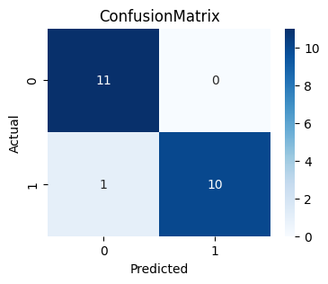


* The area under the ROC curve (ROC AUC) is **95.45%**, indicating excellent discrimination between positive and negative instances. A higher ROC AUC value suggests that the model can effectively distinguish between the two classes, making it a reliable classifier.

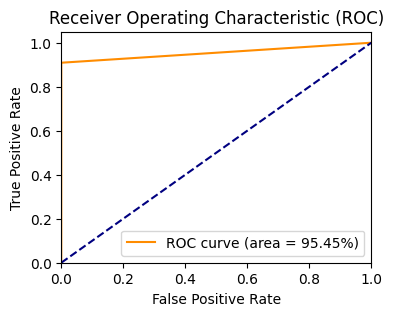


# Demo

The following figures showcase the predictions of model **16** (the best model: ResNet18/multi-layer/SGD/on GPU) for unseen gel images. During the evaluation of 11 test images, this model did an impressive job successfully classifying all of them.


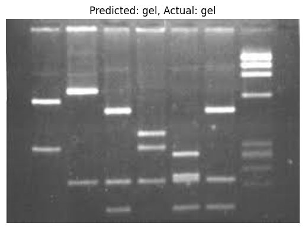
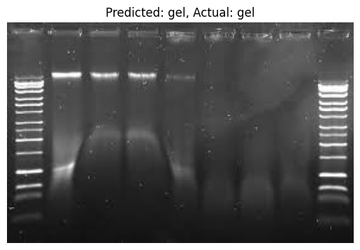
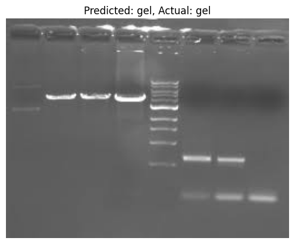
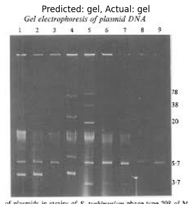
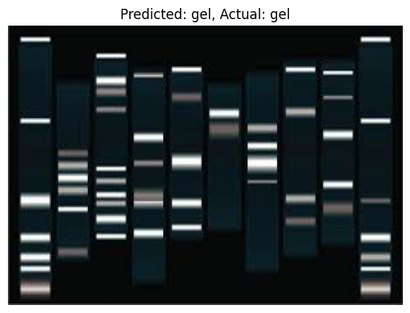
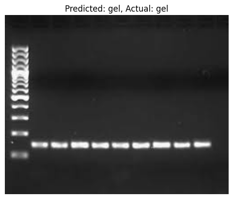
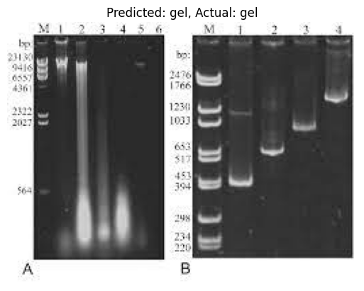
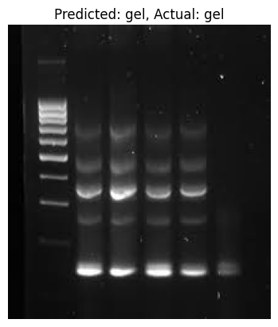
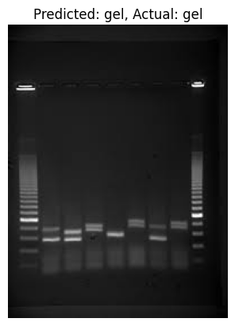
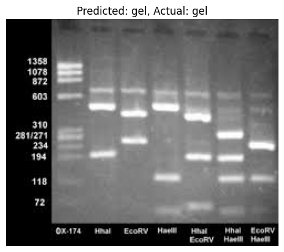
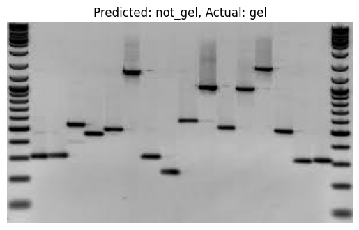


# Conclusion and Key Findings

The high performance of model 16 can be attributed to several factors: 

1- the **ResNet18** architecture provided a good feature extraction backbone suited for this image classification task, it enables the model to learn complex patterns and representations specific to gel electrophoresis images.

2- the **multi-layer** classifier head provided a more complex, deeper classification capability compared to a single linear layer. By adding multiple linear layers on top of the ResNet18 backbone, it allowed the model to perform a more detailed decision-making process during classification.

3- the choice of the **SGD** optimizer contributes to the model's success, leading to better convergence and improved generalization.

4- training the model on a GPU significantly accelerates the training process. This enables faster computation of the forward and backward passes during training, resulting in quicker convergence and reduced training time. This allows model 16 achieved the fastest training time of **19.08** seconds (equivalent to 0.318 minutes) compared to the CPU models.


In conclusion, the outstanding performance of model **16** demonstrates the effectiveness and reliability of this configuration:

* Hardware Type: **GPU**
* Pretrained Model: **ResNet18**
* Classifier Head: **Multi-Layer**
* Optimization Algorithm: **SGD**

and highlights the suitability of the model for real-world gel electrophoresis image classification tasks, offering potential benefits in scientific research.