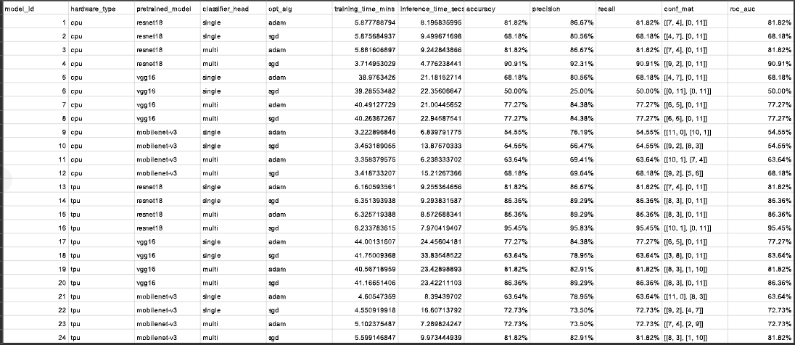

# Project Overview

This project aims to develop and train multiple image classification models using pretrained convolutional neural network (CNN) architectures as backbones on a custom dataset of gel electrophoresis images. The goal is to explore the performance of these models with different configurations, including various classifier heads and optimization algorithms. The project utilizes transfer learning techniques via feature extraction and is implemented using the PyTorch deep learning framework within the Google Colab environment.

Gel electrophoresis is a widely used technique in molecular biology for separating DNA, RNA, or proteins based on their size and charge. Accurate classification of gel images is crucial for various biological research applications. This project focuses on developing effective models to automate the classification process.

## Goal

The goal of this project is to investigate and compare the performance of different models in classifying grayscale gel images. By training and evaluating 24 models with varying configurations, I aim to identify the most effective model architecture and configuration for accurate gel electrophoresis image classification.

## Models and Configurations

The models were evaluated based on four factors that influenced the training:

**1- Model Architecture:**

Three pretrained CNN backbones were used - ResNet18, VGG16 and MobileNetV3. 

**2- Classifier Head:**

Each backbone was used as a feature extractor and customized by replacing the final fully connected layer with either:

* Single linear layer as the classifier head (single layer for shortcut): This configuration consists of a single linear layer for classification.

* Multiple sequential layers as the classifier head (multi-layer for shortcut): This configuration comprises multiple sequential layers for classification, providing a deeper and more complex structure.

**3- Optimizer Algorithm:**

Each architecture/head combination was trained with either: the Adam and SGD optimizers (both with fixed 0.001 learning rate for fair comparison).	

* Adam is an adaptive learning rate optimization algorithm that is widely used for its simplicity and robustness. It adjusts the learning rate dynamically during training to improve convergence.

* SGD (Stochastic Gradient Descent) is a traditional optimization algorithm that updates the model parameters with the gradients of the loss function. It iteratively adjusts the weights with a fixed learning rate to minimize the loss.

**4- Hardware platform:**

Models were trained on two types of hardware platforms: 

* CPU (Central processing unit)

* TPU (Tensor processing unit) specifically designed for machine learning tasks.

## Configuration Breakdown

The 24 models can be categorized based on their configurations:

Hardware Type:
   * 12 models were trained on CPU platform.
   * 12 models were trained on TPU platform.

Pretrained Model:
   * 8 models were based on the ResNet18 architecture.
   * 8 models were based on the VGG16 architecture.
   * 8 models were based on the MobileNet-V3 architecture.

Classifier Head:
   * 12 models had a single linear layer as the classifier head.
   * 12 models had a multi-layer as the classifier head.

Optimization Algorithm:
   * 12 models used the Adam optimizer algorithm.
   * 12 models used the SGD optimizer algorithm.

## Folders

* `dataset`: Contains the dataset used for the gel project image classification. It contains a collection of gel electrophoresis images that were labeled and organized into two subfolders based on their class (gel, not_gel).

* `test_images`: Contains Contains separate gel electrophoresis images used for evaluating the trained models. These images were not included in the training dataset.

## Files

The project contains 4 core Python script files that work together to efficiently build, tune and evaluate various deep learning models on this image classification benchmark in a structured, comparable manner:

* `utils.py`: Contains utility functions used throughout the project. It includes data transformation functions for training, validation, and testing, as well as functions for training and validating the model, saving plots of the training progress, and saving the results to a CSV file. 

* `build_dataset.py`: Contains code to load the dataset, preprocess the images, and split the data into training and validation sets using a custom Dataset class.

* `prepare_model.py`: Implements functions to initialize pretrained CNN architectures (ResNet18, VGG16, MobileNetV3) from PyTorch, modifying them for grayscale input and customized classification heads.

* `train.py`: Implements the main training loop logic, handling command line parameter parsing, model selection, data loading, training, validation, metric tracking, model saving, and result logging.

* `results.csv`: This CSV file stores the results of different model training experiments, including model ID, architecture, training parameters, and evaluation metrics for each experiment. The file is updated with new results each time a model is trained and evaluated.

# Results

## The most effective configurations:

* ResNet18 model achieved the highest accuracies using a multi-layer classifier head and SGD optimizer. Specifically, the ResNet18 model trained on TPU with these settings (Model ID 16) achieved the maximum accuracy of 95.45%. Meanwhile, the ResNet18 model trained on CPU with a multi-layer head and SGD (Model ID 4) obtained a slightly lower but still high accuracy of 90.91%. This demonstrates that although both models performed well overall, the TPU-based ResNet18 configuration led to the best result for this task.

## Further analysis and observations:

* ResNet18 architecture shows consistent performance across different configurations. Models with ResNet18 achieve high accuracy and balanced precision and recall values, this suggests ResNet18 is better suited for this task.

* VGG16 models performed reasonably well, achieving accuracies of 77.27-86.36% on both the CPU and TPU (Model IDs 7, 8, 20).

* MobileNetV3 models performed the worst, with maximum accuracy of 81.82% (Model ID 24). 
The lighter weight architecture seems less optimal for this task than heavier ResNet18 and VGG16.

* VGG16 with a single classifier head and SGD optimizer had the lowest accuracy of 50.00% on a CPU (Model ID 6). This model struggled to effectively classify the data.

* Models with multi-layer as the classifier head outperformed models with single layer as the classifier head for all settings on both the CPU and TPU. This suggests that the extra layers help learn more complex features.

	* For example, ResNet18 with single layer classifier achieved 86.36% accuracy on TPU using SGD optimizer (Model ID 14) vs 95.45% with multi-layer classifier using the same settings (Model ID 16). Biggest difference was for VGG16 with single layer classifier achieved 50.00% accuracy on CPU using SGD optimizer (Model ID 6) vs 77.27% with multi-layer classifier using the same settings (Model ID 8). The improved performance indicates multi-layer as the classifier head have greater representation power for this classification problem. 

* Both Adam and SGD worked well but SGD generally achieved higher accuracy than Adam across different model architectures/configurations, often by significant improvements like ResNet18 with Adam optimizer on TPU achieved 86.36% accuracy (Model ID 15) vs 95.45% accuracy with SGD optimizer using the same settings (Model ID 16). Suggesting SGD converges better and may be better suited than Adam for this specific image classification task.

* Training on the TPU led to better results than the CPU for all models, with accuracy improvements of 3-15%. The accelerated compute of the TPU benefited the training.

* Heavy models like VGG16 took the longest to train (38-44 mins). ResNet18 and MobileNetV3 were faster (~3-6 mins).

* Inference time followed relative model complexity. VGG16 > ResNet18 > MobileNetV3. 

## Conclusion

Overall, ResNet18/multi-layer/SGD on TPU (Model ID 16) stood out as it led to the best performance based on the evaluation metrics with reasonable training and inference times of 6.23 minutes and 7.97 seconds.

This systematic evaluation provided valuable insights into how architectural decisions, optimizer choice, and hardware can impact model effectiveness. The best combination identified here demonstrates an optimized configuration for highly accurate gel image classification.