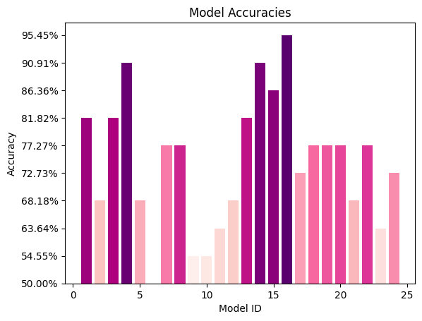
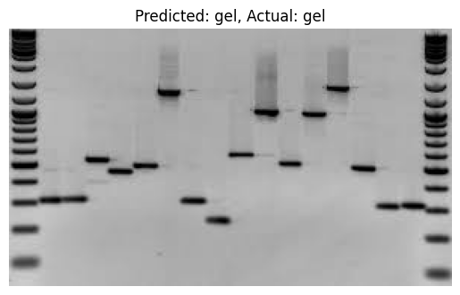

# Project Overview

This project aims to develop and train multiple image classification models using pretrained convolutional neural network (CNN) architectures as backbones on a custom dataset of gel electrophoresis images. The goal is to explore the performance of these models with different configurations, including various classifier heads and optimization algorithms. The project utilizes transfer learning techniques via feature extraction and is implemented using the PyTorch deep learning framework within the Google Colab environment.

Gel electrophoresis is a widely used technique in molecular biology for separating DNA, RNA, or proteins based on their size and charge. Accurate classification of gel images is crucial for various biological research applications. This project focuses on developing effective models to automate the classification process.


## Goal

The goal of this project is to investigate and compare the performance of different models in classifying grayscale gel images. By training and evaluating 24 models with varying configurations, I aim to identify the most effective model architecture and configuration for accurate gel electrophoresis image classification.


## Dataset 

The [dataset](dataset/) consists of 92 grayscale gel electrophoresis images gathered from the internet and organized into two subfolders based on their class, 'gel' and 'not_gel'. Each class contains 46 images, resulting in a balanced dataset.


## Models and Configurations

The models were evaluated based on four factors that influenced the training:

**1- Model Architecture:**

As a backbone, I chose 3 pretrained CNN architectures to be implemented in this project:

* ResNet18

* VGG16 

* MobileNetV3


**2- Classifier Head:**

I used the mentioned backbones as a feature extractor and customized them by replacing the final fully connected layer with either:

* Single linear layer as the classifier head (single layer for shortcut): This configuration consists of a single linear layer for classification.

* Sequential multi-layer as the classifier head (multi-layer for shortcut): This configuration comprises multiple linear layers for classification, providing a deeper and more complex structure.


**3- Optimizer Algorithm:**

I trained each architecture/head combination using either the Adam or SGD optimizer. Both optimizers utilized the CrossEntropyLoss function and were set with a fixed learning rate of 0.001 to ensure a fair comparison.

* Adam: is an adaptive learning rate optimization algorithm that is widely used for its simplicity and robustness. It adjusts the learning rate dynamically during training to improve convergence.

* SGD (Stochastic Gradient Descent): is a traditional optimization algorithm that updates the model parameters with the gradients of the loss function. It iteratively adjusts the weights with a fixed learning rate to minimize the loss.


**4- Hardware platform:**

I trained the models on two types of hardware platforms:

* CPU (Central processing unit): designed for sequential serial processing.

* GPU (Graphics processing unit): designed for parallel processing which makes it useful for accelerating machine learning and deep learning tasks.


## Configurations Breakdown

| Configuration | Number of Models |
|---|---|
| **Hardware Type** | |
| CPU | 12 |
| GPU | 12 |
| **Pretrained Model** | |
| ResNet18 | 8 |
| VGG16 | 8 |
| MobileNet-V3 | 8 |
| **Classifier Head** | |
| Single Linear Layer | 12 |
| Multi-Layer | 12 |
| **Optimization Algorithm** | |
| Adam | 12 |
| SGD | 12 |


# Project Pipeline and Workflow

The project consists of 4 core Python script files that collaborate in the model development process in a structured and modular manner:

* `utils.py`: contains reusable utility functions used throughout the project.

* `build_dataset.py`: implements code to load the dataset, preprocess the images, and split the data into training and validation sets.

* `prepare_model.py`: implements functions to initialize pretrained CNN architectures (ResNet18, VGG16, MobileNetV3) from PyTorch, modifying them for grayscale input and customized classification heads.

* `train.py`: implements the main training loop logic, handling command-line parameter parsing, model selection, data loading, training, validation, metric tracking, model saving, and result logging.


# Implementation  

Each of the following 6 notebooks focuses on training and evaluating a specific base model architecture (ResNet18, VGG16, or MobileNetV3) on either a CPU or GPU, as well as evaluating the model's performance and making inferences.

* [1_Gel_Classifier_ResNet18.ipynb](1_Gel_Classifier_ResNet18.ipynb): This Jupyter notebook showcases the implementation of training a customized ResNet18 model on CPU. 

* [2_Gel_Classifier_VGG16.ipynb](2_Gel_Classifier_VGG16.ipynb): This Jupyter notebook showcases the implementation of training a customized VGG16 model on CPU. 

* [3_Gel_Classifier_MobileNetV3.ipynb](3_Gel_Classifier_MobileNetV3.ipynb): This Jupyter notebook showcases the implementation of training a customized MobileNetV3 model on CPU.

* [4_Gel_Classifier_ResNet18.ipynb](4_Gel_Classifier_ResNet18.ipynb): This Jupyter notebook showcases the implementation of training a customized ResNet18 model on GPU. 

* [5_Gel_Classifier_VGG16.ipynb](5_Gel_Classifier_VGG16.ipynb): This Jupyter notebook showcases the implementation of training a customized VGG16 model on GPU. 

* [6_Gel_Classifier_MobileNetV3.ipynb](6_Gel_Classifier_MobileNetV3.ipynb): This Jupyter notebook showcases the implementation of training a customized MobileNetV3 model on GPU. 


# Model Training Process

To train the 24 models, I executed the `train.py` script 24 times, utilizing the 6 Jupyter notebooks mentioned above. I organized 4 executions within each notebook, and each run involved specifying unique model configurations through command-line arguments and providing specific file paths.

## Example:

```
python train.py 
  --dataset_dir='/dataset'
  --model_id=1
  --hardware_type='cpu'  
  --pretrained_model='resnet18'
  --classifier_head='single'
  --opt_alg='adam'
  --model_path='/gel_classifier-1.pth'
  --plots_path='/gel_classifier-1.png'
  --results_file='/results.csv'
```

## Command arguments:

| Name | Description | Default |
|-|-|-|
|--dataset_dir| Path to the Dataset Directory | './data'|
|--model_id| The ID number assigned to the model| 1|  
|--hardware_type| The type of the hardware used to train the model (cpu, gpu) |'cpu'|
|--pretrained_model| Pretrained model (resnet18, vgg16, mobilenet-v3)|'resnet18'|
|--classifier_head| The architecture of the classifier head to use (single, multi)|'single'|
|--opt_alg| Type of the optimizer algorithm to use (adam, sgd)|'adam'|
|--learning_rate| Learning rate for the optimizer|0.001|
|--batch_size| Batch size|23|
|--num_epochs| Number of training epochs|20|
|--model_path| Path to save the custom trained model parameters/weights|'./models/model.pth'|
|--plots_path| Path to save the loss and accuracy plots|'./plots/'|
|--results_file| Path to save the comparison results|'results.csv'|


# Model Evaluation

The table below summarizes the performance of the 24 models trained with different architectures and hyperparameters, each row in the table corresponds to a specific model configuration. The results were recorded in the [results.csv](results.csv) file generated at the end of training for each model. 


| model_id | hardware_type | pretrained_model | classifier_head | opt_alg | training_time_mins | inference_time_secs | accuracy | precision | recall | conf_mat | roc_auc |
|-|-|-|-|-|-|-|-|-|-|-|-|
| 1 | cpu | resnet18 | single | adam | 5.87778879404068 | 8.196835994720459 | 81.82% | 86.67% | 81.82% | [[7, 4], [0, 11]] | 81.82% |
| 2 | cpu | resnet18 | single | sgd | 5.875684936841329 | 9.499671697616575 | 68.18% | 80.56% | 68.18% | [[4, 7], [0, 11]] | 68.18% |
| 3 | cpu | resnet18 | multi | adam | 5.881606896718343 | 9.242843866348268 | 81.82% | 86.67% | 81.82% | [[7, 4], [0, 11]] | 81.82% | 
| 4 | cpu | resnet18 | multi | sgd | 3.714953029155731 | 4.776238441467285 | 90.91% | 92.31% | 90.91% | [[9, 2], [0, 11]] | 90.91% |
| 5 | cpu | vgg16 | single | adam | 38.97634260257085 | 21.181527137756348 | 68.18% | 80.56% | 68.18% | [[4, 7], [0, 11]] | 68.18% |
| 6 | cpu | vgg16 | single | sgd | 39.28553481896719 | 22.356066465377808 | 50.00% | 25.00% | 50.00% | [[0, 11], [0, 11]] | 50.00% | 
| 7 | cpu | vgg16 | multi | adam | 40.49127728939057 | 21.004456520080566 | 77.27% | 84.38% | 77.27% | [[6, 5], [0, 11]] | 77.27% |
| 8 | cpu | vgg16 | multi | sgd | 40.26367266575495 | 22.94587540626526 | 77.27% | 84.38% | 77.27% | [[6, 5], [0, 11]] | 77.27% |
| 9 | cpu | mobilenet-v3 | single | adam | 3.222896846135457 | 6.839791774749756 | 54.55% | 76.19% | 54.55% | [[11, 0], [10, 1]] | 54.55% |
| 10 | cpu | mobilenet-v3 | single | sgd | 3.4531890551249185 | 13.87570333480835 | 54.55% | 56.47% | 54.55% | [[9, 2], [8, 3]] | 54.55% |  
| 11 | cpu | mobilenet-v3 | multi | adam | 3.35837957461675 | 6.238333702087402 | 63.64% | 69.41% | 63.64% | [[10, 1], [7, 4]] | 63.64% |
| 12 | cpu | mobilenet-v3 | multi | sgd | 3.4187332073847454 | 15.212673664093018 | 68.18% | 69.64% | 68.18% | [[9, 2], [5, 6]] | 68.18% |
| 13 | gpu | resnet18 | single | adam | 0.3079824447631836 | 4.64704704284668 | 81.82% | 86.67% | 81.82% | [[7, 4], [0, 11]] | 81.82% |
| 14 | gpu | resnet18 | single | sgd | 0.3234382589658101 | 6.50952672958374 | 90.91% | 92.31% | 90.91% | [[9, 2], [0, 11]] | 90.91% |
| 15 | gpu | resnet18 | multi | adam | 0.3120910326639811 | 5.272719383239746 | 86.36% | 89.29% | 86.36% | [[8, 3], [0, 11]] | 86.36% |  
| 16 | gpu | resnet18 | multi | sgd | 0.3181058406829834 | 6.478391647338867 | 95.45% | 95.83% | 95.45% | [[11, 0], [1, 10]] | 95.45% |
| 17 | gpu | vgg16 | single | adam | 0.9037617484728496 | 4.949237108230591 | 72.73% | 82.35% | 72.73% | [[5, 6], [0, 11]] | 72.73% |
| 18 | gpu | vgg16 | single | sgd | 0.5543939312299092 | 5.194904088973999 | 77.27% | 79.46% | 77.27% | [[7, 4], [1, 10]] | 77.27% | 
| 19 | gpu | vgg16 | multi | adam | 0.5677111983299256 | 5.921305418014526 | 77.27% | 84.38% | 77.27% | [[6, 5], [0, 11]] | 77.27% |
| 20 | gpu | vgg16 | multi | sgd | 0.5407225330670674 | 6.444743633270264 | 77.27% | 79.46% | 77.27% | [[7, 4], [1, 10]] | 77.27% |
| 21 | gpu | mobilenet-v3 | single | adam | 1.3680107553799947 | 4.879338026046753 | 68.18% | 69.64% | 68.18% | [[9, 2], [5, 6]] | 68.18% | 
| 22 | gpu | mobilenet-v3 | single | sgd | 0.3197624882062276 | 5.102678060531616 | 77.27% | 79.46% | 77.27% | [[7, 4], [1, 10]] | 77.27% |
| 23 | gpu | mobilenet-v3 | multi | adam | 0.3326810797055562 | 5.30916953086853 | 63.64% | 78.95% | 63.64% | [[11, 0], [8, 3]] | 63.64% |
| 24 | gpu | mobilenet-v3 | multi | sgd | 0.3393968224525451 | 5.609779596328735 | 72.73% | 82.35% | 72.73% | [[11, 0], [6, 5]] | 72.73% |


# Performance Comparison Visualizations

The figures below provide a visual comparison of various performance metrics for the 24 models including accuracy, precision, recall, ROC AUC as well as training and inference times. Bar charts compare individual metrics across models while heatmaps show each model's performance across all metrics. Additional charts analyze the impact of model architecture, hardware type, classifier head and optimizer on accuracy.




## The most effective configurations:

* ResNet18 model achieved the highest accuracies using a multi-layer classifier head and SGD optimizer. Specifically, the ResNet18 model trained on TPU with these settings (Model ID 16) achieved the maximum accuracy of 95.45%. Meanwhile, the ResNet18 model trained on CPU with a multi-layer head and SGD (Model ID 4) obtained a slightly lower but still high accuracy of 90.91%. This demonstrates that although both models performed well overall, the TPU-based ResNet18 configuration led to the best result for this task.

## Further analysis and observations:

* ResNet18 architecture shows consistent performance across different configurations. Models with ResNet18 achieve high accuracy and balanced precision and recall values, this suggests ResNet18 is better suited for this task.

* VGG16 models performed reasonably well, achieving accuracies of 77.27-86.36% on both the CPU and TPU (Model IDs 7, 8, 20).

* MobileNetV3 models performed the worst, with maximum accuracy of 81.82% (Model ID 24). 
The lighter weight architecture seems less optimal for this task than heavier ResNet18 and VGG16.

* VGG16 with a single classifier head and SGD optimizer had the lowest accuracy of 50.00% on a CPU (Model ID 6). This model struggled to effectively classify the data.

* Models with multi-layer as the classifier head outperformed models with single layer as the classifier head for all settings on both the CPU and TPU. This suggests that the extra layers help learn more complex features.

	* For example, ResNet18 with single layer classifier achieved 86.36% accuracy on TPU using SGD optimizer (Model ID 14) vs 95.45% with multi-layer classifier using the same settings (Model ID 16). Biggest difference was for VGG16 with single layer classifier achieved 50.00% accuracy on CPU using SGD optimizer (Model ID 6) vs 77.27% with multi-layer classifier using the same settings (Model ID 8). The improved performance indicates multi-layer as the classifier head have greater representation power for this classification problem. 

* Both Adam and SGD worked well but SGD generally achieved higher accuracy than Adam across different model architectures/configurations, often by significant improvements like ResNet18 with Adam optimizer on TPU achieved 86.36% accuracy (Model ID 15) vs 95.45% accuracy with SGD optimizer using the same settings (Model ID 16). Suggesting SGD converges better and may be better suited than Adam for this specific image classification task.

* Training on the TPU led to better results than the CPU for all models, with accuracy improvements of 3-15%. The accelerated compute of the TPU benefited the training.

* Heavy models like VGG16 took the longest to train (38-44 mins). ResNet18 and MobileNetV3 were faster (~3-6 mins).

* Inference time followed relative model complexity. VGG16 > ResNet18 > MobileNetV3. 


## Demo

The following figures showcase the predictions of the ResNet18/multi-layer/SGD model on GPU (model_id: 16) for unseen gel images. During the evaluation of 11 test images, this model did an impressive job successfully classifying all of them.





This outstanding performance underscores the effectiveness and reliability of the ResNet18 architecture combined with the multi-layer approach and the Stochastic Gradient Descent (SGD) optimizer on GPU hardware. Additionally, it highlights the suitability of this model for gel electrophoresis image classification tasks in real-world applications, with potential benefits in scientific research.


## Conclusion

This systematic evaluation provided valuable insights into how architectural decisions, optimizer choice, and hardware can impact model effectiveness. The best combination identified here demonstrates an optimized configuration for highly accurate gel image classification.